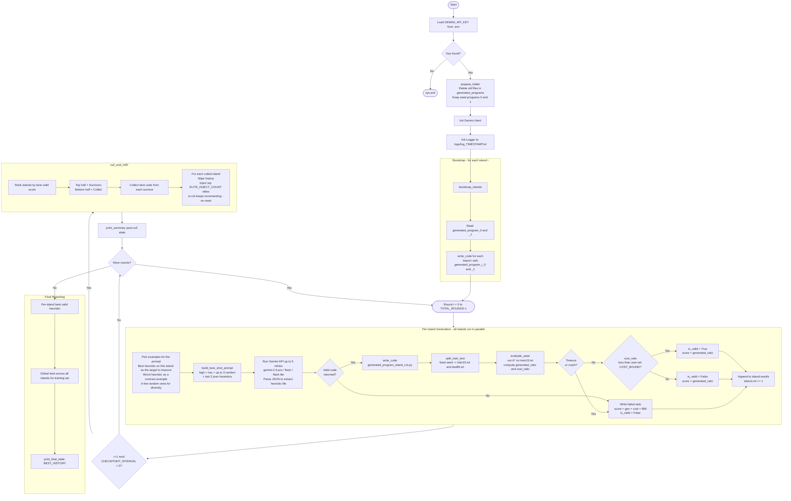

# 15Puzzle_Search

This repo implements an LLM-driven evolutionary search (FunSearch-style) that discovers heuristic functions for Korf's 100 15-puzzle benchmark instances. Generated heuristics are scored by how many nodes A\* expands relative to Korf's IDA\* baseline, subject to a user-set cost bound on solution quality. The two main entry points are `h_search.py` (run the evolutionary search) and `baseline_comp.py` (compare the 7 pre-generated heuristics in `heuristics_seed_42/` against a Weighted A\* + MDLC baseline sweep).

# How to Run h_search.py

## 0. Clone the Repository

```bash
git clone https://github.com/Lee-Li-404/15Puzzle_Search.git
cd 15Puzzle_Search
```

## 1. Install Dependencies

Install the required Python packages:

```bash
pip install google-genai python-dotenv matplotlib
```

If your system uses `pip3` for Python 3 packages, use:

```bash
pip3 install google-genai python-dotenv matplotlib
```

## 2. Set Up Your API Key

Create a `.env` file in the project root and add your Gemini API key:

```
GEMINI_API_KEY=your_api_key_here
```

To get $300 free Gemini API credit, see: https://youtu.be/L7nW94rKqLg

## 3. Configure Parameters

Open `h_search.py` and set your parameters at the top of the file. At minimum, set:

- `COST_BOUND` — how strictly optimal the solutions need to be
- `TOTAL_ROUNDS` — how long to run the search
- `NUM_ISLANDS` — how many parallel islands to use
- `CHECKPOINT_INTERVAL` — how many rounds between each cull-and-refill island event

For a quick test run that finishes in reasonable time, use:

```python
COST_BOUND = 1.85
TOTAL_ROUNDS = 6
NUM_ISLANDS = 4
CHECKPOINT_INTERVAL = 4
```

The heuristics in `heuristics_seed_42/` were produced using the default parameters listed in the parameter reference below.

See the parameter reference below for full details.

## 4. Run

```bash
python h_search.py
```

Output is printed to the terminal and simultaneously saved to a timestamped log file in the `logs/` folder. Generated heuristics are saved to `generated_programs/`.

---

# How to Run baseline_comp.py

`baseline_comp.py` is the main comparison script for the project. It evaluates the 7 pre-generated heuristics in `heuristics_seed_42/` against a sweep of Weighted A\* (WA\*) baselines using the Manhattan Distance + Linear Conflict heuristic.

The 7 LLM heuristics were produced using `h_search.py` with train/test split seed 42 and varying cost bounds across runs. This script is how we compare the LLM-evolved heuristics against the WA\* with MDLC baseline.

No configuration is needed.

## Run

```bash
python baseline_comp.py
```

This will:

1. Create a fixed train/test split from `test_full.txt` using seed 42
2. Evaluate all 7 LLM heuristics and a sweep of WA\* weights on the test set
3. Print a summary table of generated ratio, cost ratio, and runtime for each heuristic
4. Display two comparison diagrams:
   - **Observed maximum cost ratio vs average runtime** — shows how solution quality trades off against speed
   - **Observed maximum cost ratio vs average generated nodes ratio** — shows how solution quality trades off against search efficiency

Note that the results produced by this script may not look exactly the same as the diagrams in the manuscript. The codebase has since moved to `astar_standard.py` as a more standard and correct implementation of generated node counting. The results are similar overall, but the new counting may not perform as strongly as the previous implementation, particularly at looser cost bounds. For more details on the different definitions of generated nodes and how each implementation counts them, see the A\* implementation descriptions in the Code File Description section below.

Runtime and generated nodes are computed in real time during the script. For more accurate timing averages, change the repeat count from `1` to `5` (or any number) at lines 130 and 136 — the script will run each heuristic multiple times and report the average.

---

# h_search.py Walk Through

## User-Set Parameters

These are the primary parameters you should tune before each run.

| Parameter               | Default | What it controls                                                                                                                                                                                                                                                                                                                        |
| ----------------------- | ------- | --------------------------------------------------------------------------------------------------------------------------------------------------------------------------------------------------------------------------------------------------------------------------------------------------------------------------------------- |
| `COST_BOUND`            | `>=1.0` | Maximum allowed solution length relative to optimal. A heuristic is only considered valid if its worst-case solution across all training puzzles stays within this bound. Set to `1.0` for strictly optimal solutions, or higher to allow the heuristic to be more aggressive and generate fewer nodes at the cost of solution quality. |
| `TOTAL_ROUNDS`          | `23`    | How many rounds of evolution to run. Each round generates one new heuristic per island. More rounds = more compute time but more chances to find a good heuristic. Too many rounds may also result in overfitting.                                                                                                                      |
| `NUM_ISLANDS`           | `8`     | How many independent evolutionary islands run in parallel. More islands = more diversity but more API calls (and API cost) per round. Even numbers are recommended for balanced culling.                                                                                                                                                |
| `CHECKPOINT_INTERVAL`   | `8`     | How many rounds between each cull-and-refill event. Lower values refresh stagnating islands more aggressively. Set equal to `TOTAL_ROUNDS` to only cull once at the very end.                                                                                                                                                           |
| `TEST_TRAIN_SPLIT_SEED` | `42`    | The random seed used to split the 100 benchmark puzzles into 15 training and 85 test instances. Changing this changes which puzzles the heuristics are trained on.                                                                                                                                                                      |

---

## Complementary Parameters

These are set to sensible defaults and usually do not need to change, but can be adjusted for specific needs.

| Parameter             | Default | What it controls                                                                                                                                                                                                                                                                                                                                                                                             |
| --------------------- | ------- | ------------------------------------------------------------------------------------------------------------------------------------------------------------------------------------------------------------------------------------------------------------------------------------------------------------------------------------------------------------------------------------------------------------ |
| `ELITE_INJECT_COUNT`  | `2`     | How many of the best heuristics from surviving islands are copied into each culled island at every checkpoint. Higher values give culled islands more material to work from but reduce diversity.                                                                                                                                                                                                            |
| `EVAL_TIMEOUT_SEC`    | `1400`  | How many seconds an evaluation subprocess is allowed to run before being killed. Set this high enough to accommodate complex heuristics. If evaluations are consistently timing out, increase this. If the cost bound is set higher, this value can often be lowered as looser bounds tend to produce faster searches.                                                                                       |
| `TEST_EVAL_INTERVAL`  | `29`    | How often (in rounds) the global best heuristic is evaluated on the held-out test set. This is purely for tracking progress and does not affect the search itself. Set this higher than TOTAL_ROUNDS to only evaluate on the test set at the very end. Under tight cost bounds, evaluating on the full 85-case test set can take a very long time, so it is often better to avoid frequent test evaluations. |
| `API_MAX_CONCURRENCY` | `8`     | Maximum number of simultaneous Gemini API calls. Should match `NUM_ISLANDS` unless you want to throttle API usage.                                                                                                                                                                                                                                                                                           |
| `SUMMARY_INTERVAL`    | `1`     | How often (in rounds) a per-island progress summary is printed to the log.                                                                                                                                                                                                                                                                                                                                   |

---

# How h_search Works

h_search is an evolutionary search process that uses a large language model (LLM) to automatically discover heuristic functions for solving the 15-puzzle. It runs multiple independent search threads in parallel, called **islands**, and periodically replaces the worst-performing ones with the best ideas found so far.



---

## Step 1 — Setup

Before the search begins, the program:

- Loads the Gemini API key from the environment
- Clears the output folder, keeping only the two starting heuristic programs
- Initializes a logger so all output is saved to a timestamped log file

---

## Step 2 — Bootstrap

Each island is seeded with the same two starting heuristics: `generated_program_0.py` and `generated_program_1.py`. These act as the initial gene pool — a baseline for the LLM to improve upon. Every island starts with an identical copy so that differences between islands emerge purely through evolution randomness that comes from the LLM.

---

## Step 3 — Evolution Loop

The search runs for a fixed number of rounds. In each round, all islands evolve simultaneously and independently.

### For each island, one round works as follows:

**3a. Pick examples for prompt augmentation**

The island looks at all the heuristics it has collected so far and picks three kinds of examples to show the LLM:

- The **best** heuristic found on this island so far — the target to improve on
- The **worst** valid heuristic — a contrast example showing what to avoid
- A few **random** heuristics from the middle — for diversity

It also includes the two most recently generated heuristics as additional context.

**3b. Build a prompt**

These examples are assembled into a structured prompt that tells the LLM:

- What the 15-puzzle is and what the goal state looks like
- What the heuristic function needs to do
- What the scoring metrics are (nodes generated and solution cost)
- What the cost bound is — the maximum allowed solution length relative to optimal

(Exact Prompt can be found in `prompt_builder.py`)

**3c. Generate a new heuristic**

The prompt is sent to Gemini. The model returns a new heuristic function. If the response fails to parse, the system retries up to 5 times across different Gemini model variants. If all attempts fail, a dummy heuristic (returning 0) is used as a fallback.

**3d. Evaluate the heuristic**

The new heuristic is saved to disk and evaluated in an isolated subprocess to prevent crashes from affecting the main process. The evaluation:

1. Creates a fixed train/test split of the korf 100 benchmark puzzles using a deterministic seed
2. Runs A\* search on 15 training puzzles using the new heuristic
3. Computes two metrics:
   - **Generated ratio** — how many nodes the heuristic caused A* to generate, relative to the IDA* baseline (lower is better)
   - **Cost ratio** — the worst-case solution length relative to optimal across all puzzles (must stay below the user-set cost bound)
4. Marks the heuristic as **valid** if the cost ratio is within the bound, **invalid** otherwise
5. The **score** used for ranking is just the **generated ratio**

If the subprocess times out or crashes, the heuristic receives a penalty score of 999 and is marked invalid.

**3e. Record the result**

The new heuristic and its scores are added to the island's history. The island's version counter increments regardless of whether the heuristic was valid or not.

---

## Step 4 — Checkpoint: Cull and Refill

Every X rounds (set by `CHECKPOINT_INTERVAL`), the search pauses to redistribute good ideas across islands:

1. Each island is ranked by the best valid heuristic it has produced
2. The **top half** of islands are designated survivors
3. The **bottom half** are culled, meaning their generated heuristics history is wiped clean (programs are still kept in the folder for reference )
4. The best heuristics from the surviving islands are copied into each culled island as a fresh starting point
5. The version counter for culled islands is never reset, so file names stay unique

According to FunSearch paper and experience, this prevents stagnation where poorly performing islands get a fresh infusion of the best ideas found so far, rather than continuing down a dead end or stuck in local optima.

---

## Step 5 — Final Reporting

After all rounds complete, the program:

- Reports the best valid heuristic found on each island
- Reports the single best heuristic found across all islands
- Prints a table showing how the global best evolved round by round
- Log of terminal output can be accessed in the logs folder

# Code File Description

## A\* Implementations

There are two A\* implementations in this repo. They are functionally equivalent in terms of the solutions they find, but differ in how they count **generated nodes**. This distinction matters because generated node count is the primary metric used throughout the project.

---

### `astar_standard.py`

Counts a node as generated every time it is produced as a successor during expansion — including nodes that are already in the closed list. This follows the definition from:

> _Artificial Intelligence: A Modern Approach_ (3rd Edition) — Russell & Norvig
>
> "This is done by **expanding** the current state; that is, applying the successor function to the current state, thereby **generating** a new set of states."

> _Heuristics: Intelligent Search Strategies for Computer Problem Solving_ — Pearl
>
> "The most elementary step of graph searching that we consider is **node generation**, that is, computing the representation code of a node from that of its parent. The new successor is then said to be generated and its parent is said to be explored."

This is the implementation used inside `h_search.py` for evaluating generated heuristics.

---

### `astar_old.py`

An earlier version that counted a node as generated only the **first time** it was inserted into OPEN — duplicates pushed to OPEN from different paths were not counted. This slightly undercounts relative to the standard definition. It was the implementation used to generate the results and diagrams in the manuscript. The current codebase has since moved to `astar_standard.py` as the correct implementation, so results produced now may differ slightly — particularly at looser cost bounds where the new counting tends to produce slightly higher generated node ratios than what appears in the manuscript.

---

## `baseline_comp.py`

This script evaluates and compares multiple heuristics for the 15-puzzle using A* and Weighted A* (WA\*).

It first creates a fixed train/test split from `test_full.txt` using seed 42, producing `train15_seed42.txt` and `test85_seed42.txt`. It then evaluates 7 previously generated heuristics (in `heuristics_seed_42`) alongside a range of WA\* heuristics built with MDLC.

For WA\*, we simply take a standard heuristic and multiply it by a weight to obtain a weighted version.

For each heuristic, the script runs A\* on the test set and reports:

- Average generated nodes ratio
- Maximum observed cost ratio
- Average runtime

Finally, it produces two comparison plots:

- Maximum Cost vs Time
- Maximum Cost vs Generated Nodes Ratio

---

## `evaluate_max.py`

Contains a function `evaluate_astar(heuristic, test_file)` that takes a heuristic function and a test file as input. It runs A\* on every test instance in the file, then returns:

1. The arithmetic mean of the node generation ratio relative to Korf’s IDA\* baseline
2. The OBSERVED maximum cost ratio across all test instances, defined as:

$$
\frac{\text{actual solution length}}{\text{optimal solution length}}
$$

The optimal solution lengths (referred to as cost in code) and IDA\* node generation counts are taken from Korf’s paper and are included in `test_full.txt`.

---

## `fifteen_state_class.py`

Defines the `State` class used to represent 15-puzzle configurations following Korf’s standard goal state representation. The class supports:

- Goal state checking
- Neighbor generation through legal tile moves
- State transitions via tile swapping
- Hashing and equality comparison for use in sets and dictionaries

Korf's version of the 15-puzzle uses the following goal state representation:

| 0   | 1   | 2   | 3   |
| :-- | :-- | :-- | :-- |
| 4   | 5   | 6   | 7   |
| 8   | 9   | 10  | 11  |
| 12  | 13  | 14  | 15  |

Here, `0` represents the blank tile, which can be swapped with adjacent tiles to generate legal moves.

---

## `h_search.py`

Main evolutionary search pipeline for generating and optimizing heuristic functions.

More detailed description are provided above.

---

## `heuristic_evaluator.py`

Provides the evaluation framework for generated heuristic functions.

The evaluation pipeline works as follows:

1. Uses `sampler.py` to create a deterministic train/test split from `test_full.txt` using a fixed random seed.
2. Loads a heuristic function dynamically from a Python file.
3. Uses `evaluate_max.py` to evaluate the heuristic on the training set.
4. Returns four evaluation outputs:
   - `generated_ratio`  
     Average node generation ratio relative to Korf’s IDA\* baseline.
   - `cost_ratio`  
     Maximum observed solution cost ratio across all evaluated instances.
   - `score`  
     The optimization score used by the framework. Currently identical to `generated_ratio`.
   - `is_valid`  
     Boolean indicating whether the heuristic satisfies the user-defined cost bound.

The file also contains multiprocessing-based infrastructure for safely running heuristic evaluations in isolated subprocesses

---

## `island_handling.py`

Implements the multi-island evolutionary search framework and island management logic.

---

## `model_generation.py`

Handles LLM-based heuristic generation and response parsing.

The file contains:

- `model_generate(prompt, client)`  
  Takes a prompt as input, randomly selects a Gemini model from a predefined list, and sends the prompt through an API call to generate a heuristic function. The function includes retry logic with exponential backoff for robustness.

- `validate_api_json(text)`  
  Parses and validates the model response to extract a usable `heuristic` function. It supports multiple response formats, including:
  - JSON payloads
  - Markdown code blocks
  - Raw text extraction

If parsing fails, the system falls back to a default heuristic that always returns `0`.

---

## `program_selector.py`

This module implements the selection logic used during island-based evolution of heuristics.

Given a list of previously evaluated heuristics (with scores and metadata), it selects:

- The **best-performing heuristic** (lowest score)
- The **worst-performing heuristic** (highest score)
- A small set of **random heuristics** for diversity

---

## `prompt_builder.py`

This module defines the prompt template used to generate new heuristics during the evolutionary search process.

Given selected heuristics from the current island (best, worst, and random), it builds a structured prompt that:

- Defines the 15-puzzle task and constraints
- Specifies optimization goals (minimize generated nodes while respecting a cost bound)
- Includes scoring signals such as generated_ratio and cost_ratio
- Injects prior heuristics as reference examples

The prompt always includes:

- The best-performing heuristic (as a strong reference)
- The worst-performing heuristic (as a failure case)
- Optional random heuristics for diversity
- Optional previous round heuristics for continuity

The template enforces a strict output format, requiring a single JSON object containing the heuristic code.

---

## `sampler.py`

This module performs a seeded train/test split for 15-puzzle instances.

By default, it splits the dataset into:

- 15 training instances
- 85 test instances

The split is randomized but deterministic when a seed is provided, ensuring reproducibility.

---

## `test_full.txt`

Contains Korf’s 100 benchmark 15-puzzle instances from _Depth-First Iterative-Deepening: An Optimal Admissible Tree Search_.

Each test instance is represented using two lines:

- **First line:**  
  Contains:
  1. Instance ID
  2. Optimal solution length
  3. Total nodes generated by IDA\*

- **Second line:**  
  Contains the tile ordering for the starting puzzle configuration.

Example format:

```text
1 57 276361933
14 13 15 7 11 12 9 5 6 0 2 1 4 8 10 3
```

This example represents:

- `1` → benchmark instance ID
- `57` → optimal number of moves required to solve the puzzle
- `276361933` → number of nodes generated by IDA\* in Korf’s paper

The second line corresponds to the following starting puzzle state:

| 14  | 13  | 15  | 7   |
| :-- | :-- | :-- | :-- |
| 11  | 12  | 9   | 5   |
| 6   | 0   | 2   | 1   |
| 4   | 8   | 10  | 3   |

---

## `test85.txt`

Subset of benchmark puzzle instances used for test evaluation (generated by sampler function)

---

## `train15.txt`

Training subset containing 15 puzzle instances (generated by sampler function)

---

---

## `test85_seed42.txt`

Subset of benchmark puzzle instances used for test evaluation (generated by sampler function with seed 42). Used in baseline_comp.py

---

## `train15_seed42.txt`

Training subset containing 15 puzzle instances (generated by sampler function with seed 42). Used in baseline_comp.py

---

## `utils.py`

A Few Utility Functions

This module contains helper functions used throughout the pipeline.

It includes utilities for:

- Safely reading files
- Extracting heuristic functions from generated code
- Writing and loading heuristic programs dynamically
- Recording and printing evaluation results
- Exporting checkpoint data to CSV

---

## `wa_md.py`

Weighted A\* implementation using the Manhattan Distance heuristic.

---

## `wa_mdlc.py`

Weighted A\* implementation using the Manhattan Distance + Linear Conflict heuristic.

---

## `generated_programs`

This folder stores all heuristic programs used and generated during the h_search process for the 15-puzzle experiments.

## Initial Bootstrap Heuristics

At the start of `h_search.py`, this folder is cleared and reinitialized with only two naive starting heuristic programs:

- `generated_program_0.py`
- `generated_program_1.py`

These serve as the initial bootstrap heuristics for the evolutionary search process.

Each island begins with one of these starting heuristics as its seed program.

## Naming Convention

Generated heuristic files follow the format:

```text
generated_program_x_y.py
```

Where:

- `x` = island ID
- `y` = version counter (`cnt`) for that island, **not** the round number

The version counter starts at `2` after bootstrap, since:

- `generated_program_x_0.py` and `generated_program_x_1.py` are the two seed heuristics

The counter increments:

- once per generation round
- additionally whenever elites are injected during `cull_and_refill` checkpoints

As a result, `y` does **not** directly correspond to the round number and may grow faster than the total number of rounds.

The `(x, y)` pair in the filename directly corresponds to the `island` and `v` fields printed in `h_search.py` logs.

Example:

```text
GLOBAL_BEST: island=0 v=4 score=0.0009 | gen=0.001 cost=1.656 | valid=True
```

This means the best heuristic is stored in:

```text
generated_program_0_4.py
```

---

## `heuristics_seed_42`

This folder stores 7 heuristic functions previously generated using `h_search.py`.

All heuristics in this folder were produced using:

- a fixed train/test split with random seed `42`
- different user-set cost bounds across runs

For each run, the stored heuristic is the best-performing (in terms of nodes generated ratio) heuristic on the training set.

These heuristics are used to generate the evaluation graphs shown in the paper.

---

## `logs`

This folder stores terminal output generated while running `h_search.py`.

Each log file captures the full console output of a single run, including:

- evaluation results
- generation progress
- island updates
- warnings and errors
- heuristic performance metrics

Log files are named using timestamps to distinguish different runs.

Example:

```text
log_20260504_021006.txt
```

which corresponds to a run started on:

- 2026-05-04
- 02:10:06
